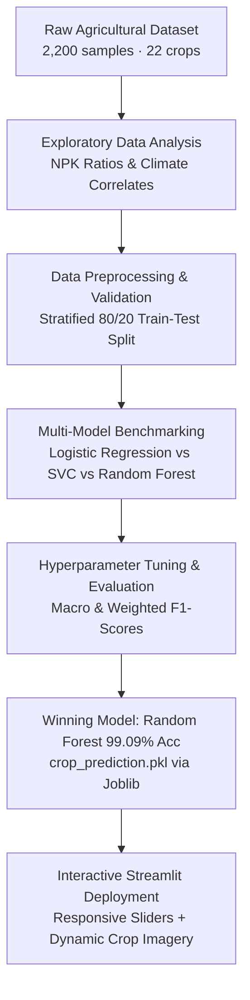

# 🌱 CropCast — Precision Agriculture Crop Recommender

An intelligent machine learning web application that recommends the optimal crop to cultivate based on soil nutrient levels and agro-climatic conditions. Built end-to-end — from exploratory data analysis and model training in Jupyter Notebook to deployment with Streamlit.


---

## 📖 Overview

In modern agriculture, selecting the right crop suited to specific soil chemistry and localized micro-climate is critical for maximizing crop yield, preserving soil health, and ensuring food security. Incorrect crop choices lead to depleted soil nutrients, heavy reliance on fertilizers, and financial losses for farmers.

**CropCast** addresses this challenge by providing data-driven recommendations. The system takes **7 fundamental soil and atmospheric indicators** as input and utilizes a trained machine learning ensemble model to predict the most suitable crop out of **22 agricultural varieties**, complete with visual verification in an intuitive UI.

---

## 📊 Input Features

The model evaluates seven primary agro-climatic parameters:

| Parameter | Agricultural Significance | Unit | Typical Range |
| :--- | :--- | :--- | :--- |
| **Nitrogen (N)** | Essential for chlorophyll synthesis, leaf development, and vegetative growth | Ratio / Index | 0 – 140 |
| **Phosphorus (P)** | Stimulates root development, flower initiation, and early maturity | Ratio / Index | 5 – 145 |
| **Potassium (K)** | Boosts disease resistance, water retention, and fruit quality | Ratio / Index | 5 – 205 |
| **Temperature** | Ambient temperature required for germination and enzymatic activity | °C | 8.0 – 45.0 °C |
| **Humidity** | Atmospheric moisture influencing transpiration and fungal risk | % | 12.0 – 100.0 % |
| **Soil pH** | Acidity/alkalinity governing nutrient bioavailability in the root zone | pH scale | 3.5 – 10.0 |
| **Rainfall** | Precipitation depth dictating moisture availability and irrigation needs | mm | 20.0 – 300.0 mm |

---

## 🌾 Supported Crops

The system classifies and provides tailored recommendations across **22 diverse crop categories**:

| Category | Crops Included |
| :--- | :--- |
| 🌾 **Cereals & Grains** | Rice, Maize |
| 🫘 **Pulses & Legumes** | Chickpea, Kidney Beans, Pigeon Peas, Moth Beans, Mung Bean, Black Gram, Lentil |
| 🍎 **Fruits & Melons** | Apple, Banana, Grapes, Mango, Muskmelon, Orange, Papaya, Pomegranate, Watermelon |
| 🧵 **Cash & Fiber Crops** | Cotton, Jute, Coconut, Coffee |

---

## 🧠 Machine Learning Pipeline & Notebook Journey

The entire machine learning pipeline was designed, experimented with, and refined from scratch inside a Jupyter Notebook before productionizing into the Streamlit application.



### 1. Exploratory Data Analysis (EDA) & Domain Insights
During notebook experimentation, detailed distribution and correlation analyses revealed distinct agricultural signatures:
- **Nutrient Fingerprints (NPK)**: 
  - Certain crops like **Apple** and **Grapes** demand exceptionally high potassium ($K > 190$), while legumes (**Chickpea**, **Lentil**, **Pigeon Peas**) thrive in low-nitrogen soil due to their biological nitrogen-fixing root nodules.
  - Cash crops like **Cotton** and **Rice** demonstrate high Nitrogen demand ($N > 80$) to sustain vegetative biomass.
- **Climatic Dependencies**:
  - **Rice** and **Jute** clustered heavily in high-rainfall zones ($> 150 \text{ mm}$) and high relative humidity ($> 80\%$).
  - **Muskmelon** and **Watermelon** required warm temperatures with moderate to low precipitation ($< 60 \text{ mm}$).
- **Soil pH Boundaries**:
  - Most fruits and pulses demonstrated tight pH tolerances (typically $6.0 - 7.5$), whereas crops like **Chickpea** and **Coffee** showed wider tolerance bands.

---

### 2. Model Selection & Benchmarking

Three distinct classification paradigms were evaluated on an independent test dataset ($n = 440$ samples across 22 classes, exactly 20 test instances per class):

| Algorithm | Overall Accuracy | Macro Precision | Macro Recall | Macro F1-Score | Weighted F1-Score |
| :--- | :---: | :---: | :---: | :---: | :---: |
| **Logistic Regression** (Baseline Linear) | 98.00% | 0.98 | 0.98 | 0.98 | 0.98 |
| **Support Vector Classifier (SVC)** (Kernel RBF) | 98.00% | 0.98 | 0.98 | 0.98 | 0.98 |
| **Random Forest Classifier** 🏆 | **99.09%** | **0.99** | **0.99** | **0.99** | **0.99** |

---

### 3. Classification Reports & Performance Analysis

#### 🌲 Model 1: Random Forest Classifier (Champion Model)
*The Random Forest ensemble demonstrated near-perfect generalization, achieving a 1.00 F1-score across 18 out of 22 classes.*

```text
              precision    recall  f1-score   support

       apple       1.00      1.00      1.00        20
      banana       1.00      1.00      1.00        20
   blackgram       1.00      0.95      0.97        20
    chickpea       1.00      1.00      1.00        20
     coconut       1.00      1.00      1.00        20
      coffee       1.00      1.00      1.00        20
      cotton       1.00      1.00      1.00        20
      grapes       1.00      1.00      1.00        20
        jute       0.95      1.00      0.98        20
 kidneybeans       1.00      1.00      1.00        20
      lentil       1.00      0.95      0.97        20
       maize       0.95      1.00      0.98        20
       mango       1.00      1.00      1.00        20
   mothbeans       0.95      1.00      0.98        20
    mungbean       1.00      1.00      1.00        20
   muskmelon       1.00      1.00      1.00        20
      orange       1.00      1.00      1.00        20
      papaya       1.00      1.00      1.00        20
  pigeonpeas       1.00      1.00      1.00        20
 pomegranate       1.00      1.00      1.00        20
        rice       1.00      0.95      0.97        20
  watermelon       1.00      1.00      1.00        20

    accuracy                           0.99       440
   macro avg       0.99      0.99      0.99       440
weighted avg       0.99      0.99      0.99       440
```

<details>
<summary><b>🔍 Click to expand: Model 2 — Support Vector Classifier (SVC) Report</b></summary>

```text
              precision    recall  f1-score   support

       apple       1.00      1.00      1.00        20
      banana       1.00      1.00      1.00        20
   blackgram       1.00      1.00      1.00        20
    chickpea       1.00      1.00      1.00        20
     coconut       1.00      1.00      1.00        20
      coffee       1.00      1.00      1.00        20
      cotton       0.91      1.00      0.95        20
      grapes       1.00      1.00      1.00        20
        jute       0.83      1.00      0.91        20
 kidneybeans       1.00      1.00      1.00        20
      lentil       0.95      0.95      0.95        20
       maize       1.00      0.90      0.95        20
       mango       1.00      1.00      1.00        20
   mothbeans       0.95      0.95      0.95        20
    mungbean       1.00      1.00      1.00        20
   muskmelon       1.00      1.00      1.00        20
      orange       1.00      1.00      1.00        20
      papaya       1.00      1.00      1.00        20
  pigeonpeas       1.00      1.00      1.00        20
 pomegranate       1.00      1.00      1.00        20
        rice       1.00      0.80      0.89        20
  watermelon       1.00      1.00      1.00        20

    accuracy                           0.98       440
   macro avg       0.98      0.98      0.98       440
weighted avg       0.98      0.98      0.98       440
```
</details>

<details>
<summary><b>🔍 Click to expand: Model 3 — Logistic Regression Report</b></summary>

```text
              precision    recall  f1-score   support

       apple       1.00      1.00      1.00        20
      banana       1.00      1.00      1.00        20
   blackgram       0.95      1.00      0.98        20
    chickpea       1.00      1.00      1.00        20
     coconut       1.00      1.00      1.00        20
      coffee       1.00      1.00      1.00        20
      cotton       0.95      1.00      0.98        20
      grapes       1.00      1.00      1.00        20
        jute       0.83      1.00      0.91        20
 kidneybeans       1.00      1.00      1.00        20
      lentil       0.95      0.95      0.95        20
       maize       1.00      0.95      0.97        20
       mango       1.00      1.00      1.00        20
   mothbeans       0.95      0.95      0.95        20
    mungbean       1.00      1.00      1.00        20
   muskmelon       1.00      1.00      1.00        20
      orange       1.00      1.00      1.00        20
      papaya       1.00      0.95      0.97        20
  pigeonpeas       1.00      0.95      0.97        20
 pomegranate       1.00      1.00      1.00        20
        rice       0.94      0.80      0.86        20
  watermelon       1.00      1.00      1.00        20

    accuracy                           0.98       440
   macro avg       0.98      0.98      0.98       440
weighted avg       0.98      0.98      0.98       440
```
</details>

---

### 4. Key Learnings & Error Analysis
- **The Rice vs. Jute Boundary**: In both Logistic Regression and SVC, **Rice** recall dropped significantly to **0.80** (with **Jute** precision dropping to **0.83**). Both crops share overlapping high-humidity and heavy-rainfall environmental envelopes. Linear and standard hyperplane boundaries struggled to separate them.
- **Why Random Forest Excelled**: Random Forest's non-linear orthogonal decision trees successfully partitioned the multi-dimensional threshold interactions between rainfall, soil potassium, and temperature, recovering Rice recall to **0.95** and Jute precision to **0.95**.
- **Deployment Decision**: Random Forest was chosen as the champion model for its robustness against collinearity, zero sensitivity to unscaled features, and superior overall classification performance (**99.09% test accuracy**).

---

### 5. Final Model Serialization
- **Model**: Tuned Random Forest Classifier
- **File Artifact**: `crop_prediction.pkl`
- **Serialization Tool**: `joblib`
- **Features Preserved**: `['N', 'P', 'K', 'temperature', 'humidity', 'ph', 'rainfall']`

---

## 🛠️ Tech Stack

| Layer | Technology | Purpose |
| :--- | :--- | :--- |
| **Frontend / UI** | Streamlit | Responsive, interactive web user interface |
| **Machine Learning** | scikit-learn | Model building, training, cross-validation & evaluation |
| **Data Processing** | pandas, NumPy | Data manipulation, tabular structure & EDA |
| **Model Persistence** | joblib | High-efficiency model serialization & deserialization |
| **Package Management**| uv / pip | Fast, deterministic dependency management |
| **Language** | Python 3.12 | Core programming environment |

---

## 🚀 Getting Started

### Prerequisites
- **Python 3.12+**
- **[uv](https://docs.astral.sh/uv/)** (recommended for blazing-fast installs) or standard `pip`

### Installation

1. **Clone the repository**
   ```bash
   git clone https://github.com/AdityaJare/crop-recommendation-app.git
   cd crop-recommendation-app
   ```

2. **Install dependencies**
   - Using `uv` (recommended):
     ```bash
     uv sync
     ```
   - Using standard `pip`:
     ```bash
     pip install -r requirements.txt
     ```

3. **Launch the web application**
   - With `uv`:
     ```bash
     uv run streamlit run main.py
     ```
   - With standard python environment:
     ```bash
     streamlit run main.py
     ```

4. **Access the application**
   Open your browser and navigate to:
   ```
   http://localhost:8501
   ```

---

## 📂 Project Structure

```text
crop-recommendation-app/
├── main.py                 # Streamlit web application & UI pipeline
├── crop_prediction.pkl     # Trained Random Forest classifier (serialized)
├── pyproject.toml          # Project configuration & dependencies
├── requirements.txt        # Pip-compatible dependency requirements
├── uv.lock                 # Locked dependency graph (uv)
├── .python-version         # Python version constraint (3.12)
├── .gitignore              # Files & directories excluded from version control
└── README.md               # Comprehensive project documentation
```

---

## 🖥️ Usage

1. **Tune Soil Parameters**: Use the intuitive sliders in Column 1 to set the soil's Nitrogen ($N$), Phosphorus ($P$), and Potassium ($K$) values.
2. **Tune Climate Conditions**: Adjust Temperature, Relative Humidity, Soil pH, and Expected Rainfall in Column 2.
3. **Generate Recommendation**: Click the **"Predict Crop"** button.
4. **View Instant Results**:
   - The app runs the values through the serialized Random Forest pipeline.
   - It outputs the recommended crop via a clear success alert (e.g., `Predicted Crop is rice`).
   - Simultaneously renders a high-definition reference photo of the recommended crop.

---

## 📦 Dependencies

| Package | Version | Description |
| :--- | :--- | :--- |
| `streamlit` | $\ge 1.64.0$ | Interactive web UI framework |
| `scikit-learn` | $== 1.9.0$ | ML algorithms & classification metrics |
| `pandas` | $\ge 3.0.6$ | Dataframe structures and feature arrays |
| `joblib` | $\ge 1.6.0$ | Python object serialization |

---

## 🤝 Contributing

Contributions, issues, and feature requests are always welcome!
1. Fork the Project
2. Create your Feature Branch (`git checkout -b feature/AmazingFeature`)
3. Commit your Changes (`git commit -m 'Add some AmazingFeature'`)
4. Push to the Branch (`git push origin feature/AmazingFeature`)
5. Open a Pull Request

---

## 📝 License

Distributed under the MIT License. Open source and available for personal, research, and educational use.

---

## 👤 Author

**Aditya Jare**
- GitHub: [@AdityaJare](https://github.com/AdityaJare)

*Built with ❤️ as an end-to-end Machine Learning project — from raw data exploration and model evaluation to cloud-ready deployment.*
